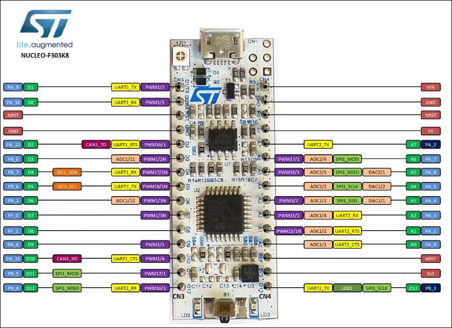

{ align=right }

=== "Left"

    1. PA9
    2. CANH -> Transceiver
    3. CANL -> Transceiver
    4. PA10
    5. PB0
    6. PB1
    7. PB4
    8. PB5
    9. PA8

=== "Right"

    1. Vin
    2. GND
    3. PA7
    4. PA4
    5. PA5
    6. PA6
    7. PA1
    8. PA0
    9. PB3

=== "CAN Transceiver"

    1. 3.3V
    2. Left 2
    3. Left 3
    4. GND

